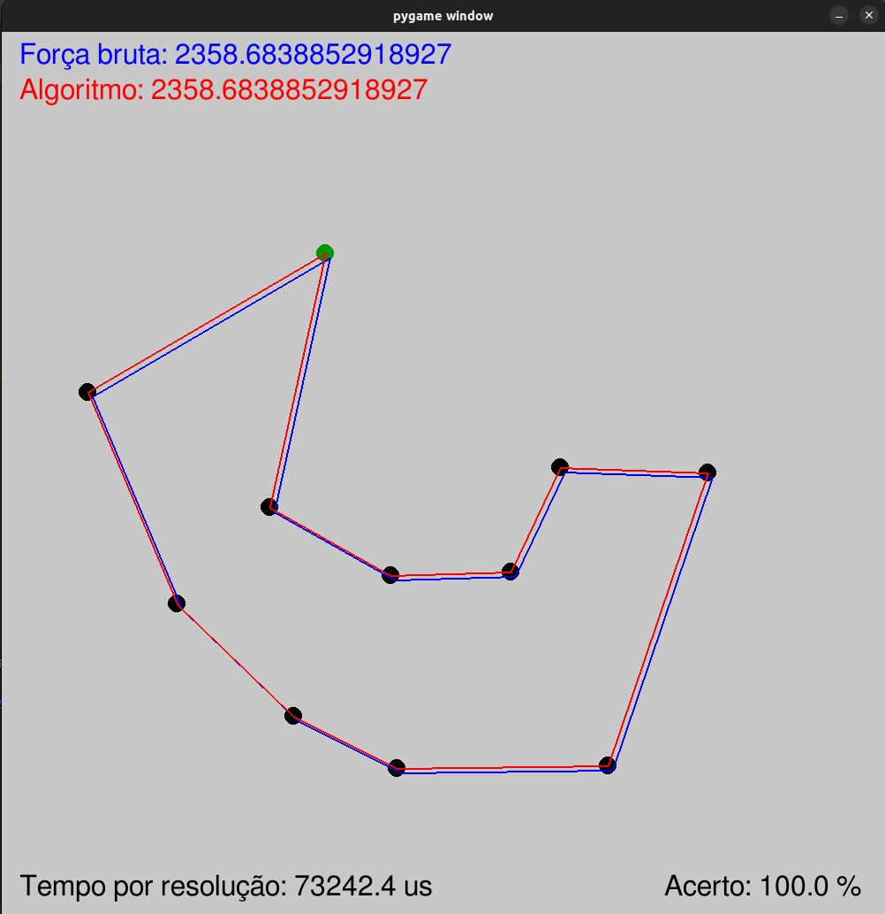
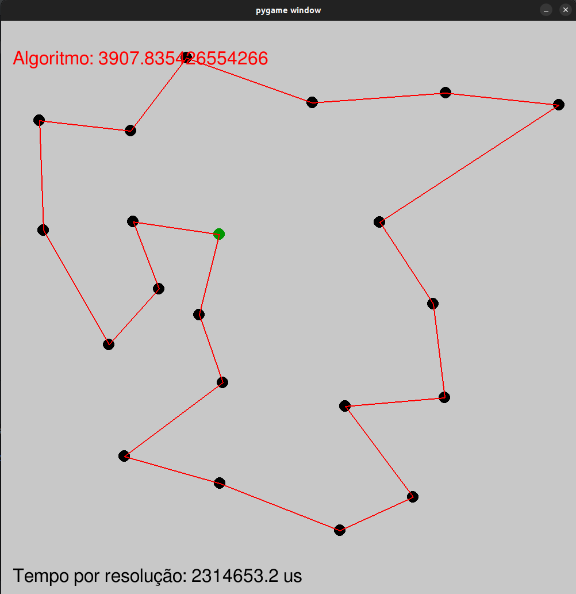
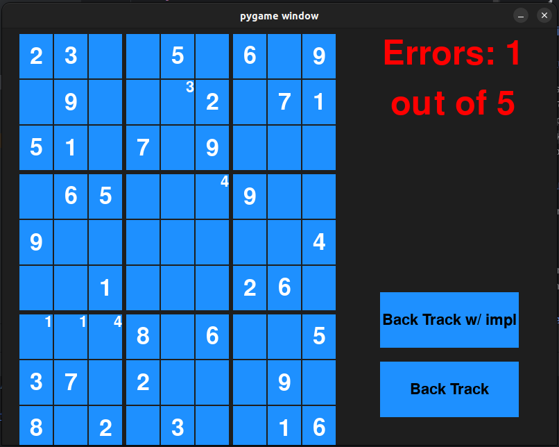
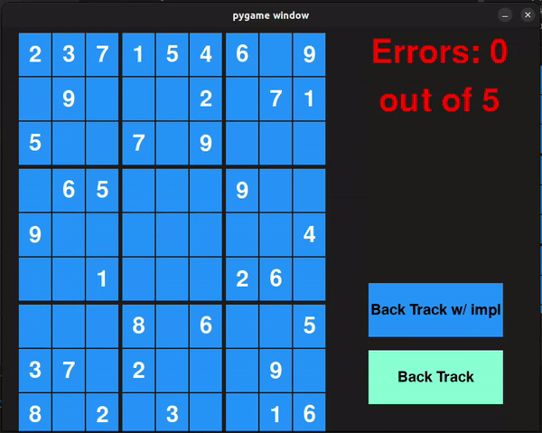
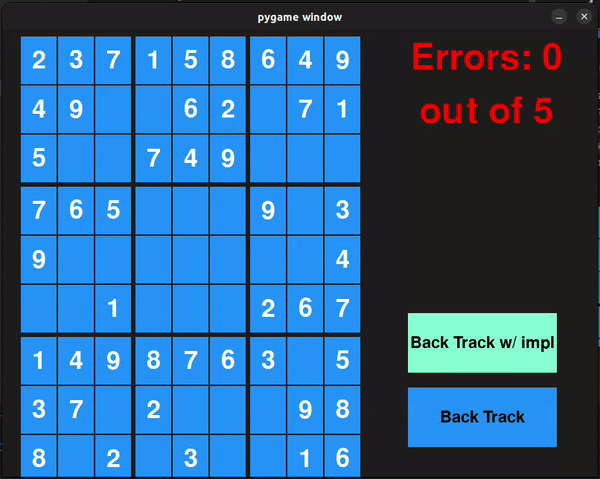

# Python Small Projects

This repository is a collection of small projects using python and 
pygame for ocasional visualizations.

## Projects

### [Traveling Salesman with Genetic Algorithm (GUI)](Genetic_Algorithm)

A aproximate solution to the traveling salesman problem using a genetic algorithm.
A GUI where points can be placed and when enter/return in pressed the algorithm tries 
to find the minimal way to traverse all of them. A brute force algorithm was also implemented
to compare the results (if you place up to 11 points).

| Solver with 11 points | Solver with 21 points |
|:---------------------:|:----------------------|
|    |    |

### [Sudoku Solver Using Backtrack (GUI)](sudoku_backtrack)

Sudoku solver using backtrack. A GUI was also implemented so the game can
be played. To play just select the tile and type a number make a guess and
enter/return to really put the number there. It's possible to visualize the solver in action by pressing
the `backtrack` button. There is also the option to use a solver that makes 
further implications after each step in the backtrack algorithm.

|                        Gameplay                        |        Backtrack Solver         |  Backtrack Solver With implications  |
|:------------------------------------------------------:|:-------------------------------:|:------------------------------------:|
|   |  |  |

### [K-mean](K-mean)

Simple implementation of K Mean algorithm for organizing data into k 
clusters.

### [KNN](KNN)

Simple implementation of K Nearest Neighbors algorithm, where a point
is classified based on its K closest points.

### [Simple Neural Network from Scratch](NeuralNetwork)

Implementation of neural network using back propagation.

### [Quick Automations](Simple_automations)

Useful automation for dynamic wall paper in Linux using realtime data
from camera at a Beach in Florianópolis Brasil. Program to send emails
to friends for secret santa.

### [Cows and bulls](Cows_and_Bulls)

Simple console implementation of the popular game cows and bulls with a
solver to try to optmize the solution.